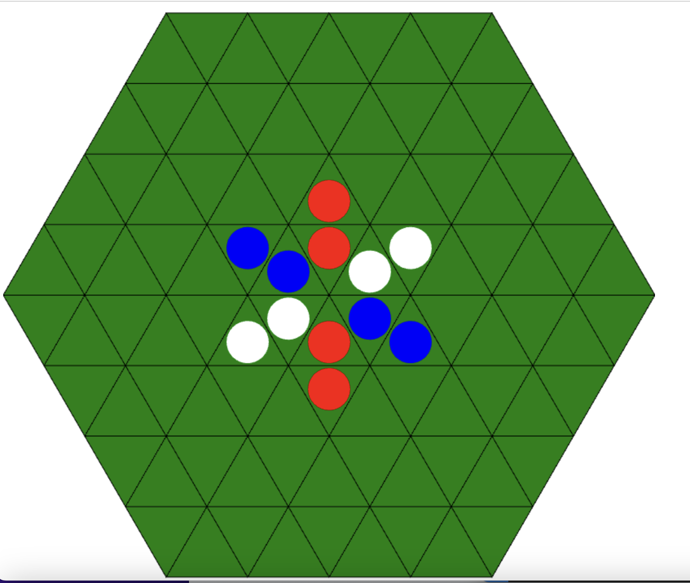

# 3人用リバーシ

https://test-b1eea.firebaseapp.com

## 概要

赤，青，白の3色の駒と96個の三角形のマスを持った六角形の盤面を使って，3人でプレイできるリバーシ．

## ルール

3人用リバーシのルール：https://fuma820.github.io/Reversi_rule/

### 参考

- RIVER SEA GROUND

    概要: 六角形の盤面と三角形の駒を使った2人用リバーシ．(WOOD LABO IKEDAとSukima.(CENSA.INC)のコラボ商品)
https://censa.jp/c/riverseaground/

    ルール: https://censa.jp/c/riverseaground/download/riverseaground.rulebook.3.2.pdf

- 六角オセロ(ドラゴンリバーシ)

    概要: 91個の六角形を繋げてできた盤面と3色の駒を使った3人用リバーシ．(開発者: 山之内洋一)
https://joe.sbody.info/%E5%85%AD%E8%A7%92%E3%82%AA%E3%82%BB%E3%83%AD/

- Triversi(トリバーシ)

    概要: 38個の点が描かれた盤面と赤，青，黄の駒を使った3人用リバーシ．(株式会社クリエイティブハウスキューズの商品)
https://gamemarket.jp/game/180597

使用したアイコン: https://icooon-mono.com/
